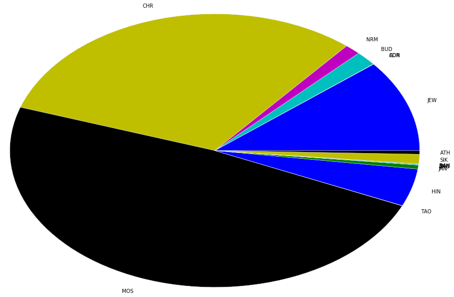

```python
import pyspark
from pyspark.sql import SQLContext
sc=pyspark.SparkContext()
sqlContext = SQLContext(sc)
% matplotlib inline
import matplotlib.pyplot as plt
plt.style.use('ggplot')
import pandas as pd
```

# 執行模式
採用分散式系統運作，master為namenode，另有三台datanodes


```python
sc.master
```


    u'spark://master:7077'


# 讀取HDFS檔案


```python
textFile=sc.textFile("hdfs://master:9000/user/ubuntu/alldata.csv")
```

# 總筆數


```python
textFile.count()
```


    43085511


# 查看前兩筆


```python
textFile.take(2)
```


    [u'642455194\t20160401\t201604\t2016\t2016.2493\t\t\t\t\t\t\t\t\t\t\tGOV\tGOVERNMENT\t\t\t\t\t\tGOV\t\t\t0\t051\t051\t05\t1\t3.4\t6\t1\t6\t1.58343483556638\t0\t\t\t\t\t\t\t\t4\tNiagara Falls, Ontario, Canada\tCA\tCA08\t30536\t43.1\t-79.05\t-570141\t4\tNiagara Falls, Ontario, Canada\tCA\tCA08\t30536\t43.1\t-79.05\t-570141\t20170401000000\thttp://www.thoroldedition.ca/2017/03/31/15m-to-fuel-transit',
     u'642455195\t20160401\t201604\t2016\t2016.2493\t\t\t\t\t\t\t\t\t\t\tSAU\tSAUDI\tSAU\t\t\t\t\t\t\t\t0\t190\t190\t19\t4\t-10.0\t2\t1\t2\t0.14219234746639\t0\t\t\t\t\t\t\t\t3\tRayburn House Office Building, District of Columbia, United States\tUS\tUSDC\t\t38.8868\t-77.0105\t528876\t3\tRayburn House Office Building, District of Columbia, United States\tUS\tUSDC\t\t38.8868\t-77.0105\t528876\t20170401000000\thttp://www.centcom.mil/MEDIA/Transcripts/']


```python
global stringRDD
stringRDD = textFile.map(lambda line:line.split("\t"))
```

# 查看前兩筆


```python
stringRDD.take(2)
```

# 計算 RDD 中 K 欄元素的數量 (Actor1Religion1Code)


```python
countsRDD_K=stringRDD.map(lambda x:(x[10],1)).reduceByKey(lambda x,y : x+y)
count_for_K = countsRDD_K.collect()
df_K = sqlContext.createDataFrame(count_for_K)
df_K.sort('_2').show()
```

    +---+--------+
    | _1|      _2|
    +---+--------+
    |CON|      67|
    |BAH|      96|
    |ZRO|     151|
    |TAO|     240|
    |ADR|     258|
    |SHN|     893|
    |ATH|    3780|
    |JAN|    4997|
    |SIK|    8170|
    |NRM|    9848|
    |BUD|   13339|
    |HIN|   32372|
    |JEW|   84393|
    |CHR|  243712|
    |MOS|  293687|
    |   |42389508|
    +---+--------+
    


# 劃出 K 欄各宗教的圓餅圖


```python
aaaa=df_K.toPandas()
plt.pie(aaaa.drop(0)["_2"], labels= aaaa.drop(0)["_1"],radius=3)
```


    ([<matplotlib.patches.Wedge at 0x7f380a5dc3d0>,
      <matplotlib.patches.Wedge at 0x7f380a5dcd50>,
      <matplotlib.patches.Wedge at 0x7f380a5e9710>,
      <matplotlib.patches.Wedge at 0x7f380a5f40d0>,
      <matplotlib.patches.Wedge at 0x7f380a5f4a50>,
      <matplotlib.patches.Wedge at 0x7f380a602410>,
      <matplotlib.patches.Wedge at 0x7f380a602d90>,
      <matplotlib.patches.Wedge at 0x7f380a60d750>,
      <matplotlib.patches.Wedge at 0x7f380a59c110>,
      <matplotlib.patches.Wedge at 0x7f380a59ca90>,
      <matplotlib.patches.Wedge at 0x7f380a5a9450>,
      <matplotlib.patches.Wedge at 0x7f380a5a9dd0>,
      <matplotlib.patches.Wedge at 0x7f380a5b5790>,
      <matplotlib.patches.Wedge at 0x7f380a5c3150>,
      <matplotlib.patches.Wedge at 0x7f380a5c3ad0>],
     [<matplotlib.text.Text at 0x7f380a5dc990>,
      <matplotlib.text.Text at 0x7f380a5e9390>,
      <matplotlib.text.Text at 0x7f380a5e9d10>,
      <matplotlib.text.Text at 0x7f380a5f46d0>,
      <matplotlib.text.Text at 0x7f380a5f4f90>,
      <matplotlib.text.Text at 0x7f380a602a10>,
      <matplotlib.text.Text at 0x7f380a60d3d0>,
      <matplotlib.text.Text at 0x7f380a60dd50>,
      <matplotlib.text.Text at 0x7f380a59c710>,
      <matplotlib.text.Text at 0x7f380a59cfd0>,
      <matplotlib.text.Text at 0x7f380a5a9a50>,
      <matplotlib.text.Text at 0x7f380a5b5410>,
      <matplotlib.text.Text at 0x7f380a5b5d90>,
      <matplotlib.text.Text at 0x7f380a5c3750>,
      <matplotlib.text.Text at 0x7f380a5ce110>])


# 計算 RDD 中 U 欄元素的數量 (Actor2Religion1Code)


```python
countsRDD_U=stringRDD.map(lambda x:(x[20],1)).reduceByKey(lambda x,y : x+y)
count_for_U = countsRDD_U.collect()
df_U = sqlContext.createDataFrame(count_for_U)
df_U.sort('_2').show()
```

    +---+--------+
    | _1|      _2|
    +---+--------+
    |CON|      51|
    |BAH|      97|
    |ZRO|     136|
    |TAO|     160|
    |ADR|     174|
    |SHN|     724|
    |ATH|    2809|
    |JAN|    3087|
    |SIK|    7381|
    |NRM|    8270|
    |BUD|   11198|
    |HIN|   29152|
    |JEW|   71598|
    |CHR|  203793|
    |MOS|  319084|
    |   |42427797|
    +---+--------+
    


# 劃出 U 欄各宗教的圓餅圖


```python
bbbb=df_U.toPandas()
plt.pie(bbbb.drop(0)["_2"], labels= bbbb.drop(0)["_1"],radius=3)
```


    ([<matplotlib.patches.Wedge at 0x7f380a0fdf50>,
      <matplotlib.patches.Wedge at 0x7f380a10b910>,
      <matplotlib.patches.Wedge at 0x7f380a1162d0>,
      <matplotlib.patches.Wedge at 0x7f380a116c50>,
      <matplotlib.patches.Wedge at 0x7f380a124610>,
      <matplotlib.patches.Wedge at 0x7f380a124f90>,
      <matplotlib.patches.Wedge at 0x7f380a0af950>,
      <matplotlib.patches.Wedge at 0x7f380a0be310>,
      <matplotlib.patches.Wedge at 0x7f380a0bec90>,
      <matplotlib.patches.Wedge at 0x7f380a0ca650>,
      <matplotlib.patches.Wedge at 0x7f380a0cafd0>,
      <matplotlib.patches.Wedge at 0x7f380a0d6990>,
      <matplotlib.patches.Wedge at 0x7f380a0e4350>,
      <matplotlib.patches.Wedge at 0x7f380a0e4cd0>,
      <matplotlib.patches.Wedge at 0x7f380a070690>],
     [<matplotlib.text.Text at 0x7f380a10b550>,
      <matplotlib.text.Text at 0x7f380a10bf10>,
      <matplotlib.text.Text at 0x7f380a1168d0>,
      <matplotlib.text.Text at 0x7f380a124290>,
      <matplotlib.text.Text at 0x7f380a124c10>,
      <matplotlib.text.Text at 0x7f380a0af5d0>,
      <matplotlib.text.Text at 0x7f380a0aff50>,
      <matplotlib.text.Text at 0x7f380a0be910>,
      <matplotlib.text.Text at 0x7f380a0ca2d0>,
      <matplotlib.text.Text at 0x7f380a0cac50>,
      <matplotlib.text.Text at 0x7f380a0d6610>,
      <matplotlib.text.Text at 0x7f380a0d6f90>,
      <matplotlib.text.Text at 0x7f380a0e4950>,
      <matplotlib.text.Text at 0x7f380a070310>,
      <matplotlib.text.Text at 0x7f380a070c90>])





```python
arr=['JEW','ADR','CON','BUD','NRM','CHR','MOS','TAO','HIN','JAN','ZRO','SHN','BAH','SIK','ATH']
```


```python
def sub_RDD_foreach_religion(atr1, atr2 ,religion):
    sub_string= stringRDD.filter(lambda x:x[atr1]==religion)
    cross_string=sub_string.map(lambda x:(x[atr2],1)).reduceByKey(lambda x,y : x+y)
    cross_string.collect()
    df = sqlContext.createDataFrame(cross_string)
    df.sort('_2').show()
```

# Actor 1 對 Actor 2 的宗教衝突


```python
for i in arr:
    print "================================================"
    print "Actor 1 宗教: " + str(i)
    sub_RDD_foreach_religion(10,20,i)
```

    ================================================
    Actor 1 宗教: JEW
    +---+-----+
    | _1|   _2|
    +---+-----+
    |TAO|    1|
    |NRM|    8|
    |SIK|   17|
    |ATH|   22|
    |BUD|   30|
    |JAN|   33|
    |HIN|  119|
    |CHR|  892|
    |MOS| 1063|
    |JEW| 5310|
    |   |76898|
    +---+-----+
    
    ================================================
    Actor 1 宗教: ADR
    +---+---+
    | _1| _2|
    +---+---+
    |ADR|  4|
    |   |254|
    +---+---+
    
    ================================================
    Actor 1 宗教: CON
    +---+---+
    | _1| _2|
    +---+---+
    |BUD|  1|
    |CHR|  1|
    |MOS|  1|
    |HIN|  1|
    |   | 63|
    +---+---+
    
    ================================================
    Actor 1 宗教: BUD
    +---+-----+
    | _1|   _2|
    +---+-----+
    |CON|    1|
    |ATH|    2|
    |TAO|   10|
    |SIK|   16|
    |JAN|   20|
    |JEW|   28|
    |HIN|  182|
    |CHR|  247|
    |BUD|  289|
    |MOS|  827|
    |   |11717|
    +---+-----+
    
    ================================================
    Actor 1 宗教: NRM
    +---+----+
    | _1|  _2|
    +---+----+
    |BUD|   1|
    |JEW|   2|
    |ATH|   3|
    |HIN|   5|
    |MOS|  15|
    |NRM|  66|
    |CHR| 856|
    |   |8900|
    +---+----+
    
    ================================================
    Actor 1 宗教: CHR
    +---+------+
    | _1|    _2|
    +---+------+
    |CON|     1|
    |BAH|     1|
    |TAO|     2|
    |ZRO|     2|
    |SHN|     3|
    |JAN|     5|
    |SIK|    57|
    |ATH|   162|
    |BUD|   214|
    |HIN|   355|
    |NRM|   743|
    |JEW|   923|
    |MOS|  4393|
    |CHR| 16383|
    |   |220468|
    +---+------+
    
    ================================================
    Actor 1 宗教: MOS
    +---+------+
    | _1|    _2|
    +---+------+
    |CON|     1|
    |TAO|    13|
    |ZRO|    14|
    |NRM|    21|
    |JAN|    23|
    |ATH|   113|
    |SIK|   187|
    |BUD|   665|
    |JEW|  1057|
    |HIN|  1727|
    |CHR|  4764|
    |MOS| 19873|
    |   |265229|
    +---+------+
    
    ================================================
    Actor 1 宗教: TAO
    +---+---+
    | _1| _2|
    +---+---+
    |JEW|  1|
    |TAO|  1|
    |CHR|  1|
    |ZRO|  1|
    |HIN|  2|
    |SIK|  4|
    |BUD| 10|
    |MOS| 12|
    |   |208|
    +---+---+
    
    ================================================
    Actor 1 宗教: HIN
    +---+-----+
    | _1|   _2|
    +---+-----+
    |SHN|    1|
    |CON|    1|
    |ZRO|    2|
    |TAO|    4|
    |NRM|    4|
    |ATH|    6|
    |JAN|   78|
    |JEW|  109|
    |BUD|  152|
    |SIK|  212|
    |CHR|  447|
    |HIN| 1090|
    |MOS| 2033|
    |   |28233|
    +---+-----+
    
    ================================================
    Actor 1 宗教: JAN
    +---+----+
    | _1|  _2|
    +---+----+
    |NRM|   1|
    |CHR|   1|
    |ATH|   4|
    |JEW|  12|
    |SIK|  27|
    |MOS|  29|
    |BUD|  33|
    |HIN|  73|
    |JAN|  83|
    |   |4734|
    +---+----+
    
    ================================================
    Actor 1 宗教: ZRO
    +---+---+
    | _1| _2|
    +---+---+
    |ATH|  1|
    |ZRO|  1|
    |SIK|  1|
    |TAO|  1|
    |HIN|  2|
    |CHR|  5|
    |JEW|  5|
    |MOS| 11|
    |   |124|
    +---+---+
    
    ================================================
    Actor 1 宗教: SHN
    +---+---+
    | _1| _2|
    +---+---+
    |HIN|  1|
    |CHR|  7|
    |SHN| 45|
    |   |840|
    +---+---+
    
    ================================================
    Actor 1 宗教: BAH
    +---+---+
    | _1| _2|
    +---+---+
    |BAH|  1|
    |CHR|  3|
    |   | 92|
    +---+---+
    
    ================================================
    Actor 1 宗教: SIK
    +---+----+
    | _1|  _2|
    +---+----+
    |ATH|   1|
    |ZRO|   1|
    |NRM|   2|
    |TAO|   4|
    |JEW|   8|
    |BUD|  27|
    |JAN|  27|
    |CHR|  70|
    |HIN| 194|
    |MOS| 213|
    |SIK| 556|
    |   |7067|
    +---+----+
    
    ================================================
    Actor 1 宗教: ATH
    +---+----+
    | _1|  _2|
    +---+----+
    |HIN|   1|
    |BUD|   2|
    |NRM|   4|
    |JEW|  20|
    |ATH|  51|
    |MOS| 156|
    |CHR| 222|
    |   |3324|
    +---+----+
    


# Actor 2 對 Actor 1 的宗教衝突


```python
for i in arr:
    print "================================================"
    print "Actor 2 宗教: " + str(i)
    sub_RDD_foreach_religion(20,10,i)
```
