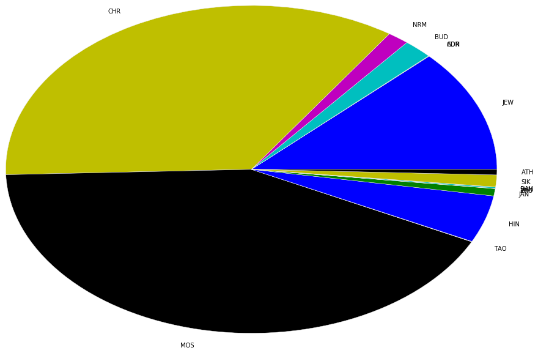

```python
import pyspark
from pyspark.sql import SQLContext
sc=pyspark.SparkContext()
sqlContext = SQLContext(sc)
% matplotlib inline
import matplotlib.pyplot as plt
plt.style.use('ggplot')
import pandas as pd
```

# 執行模式
採用分散式系統運作，master為namenode，另有三台datanodes


```python
sc.master
```


    u'spark://master:7077'


# 讀取HDFS檔案


```python
textFile=sc.textFile("hdfs://master:9000/user/ubuntu/alldata.csv")
```

# 總筆數


```python
textFile.count()
```


    43085511


# 查看前兩筆


```python
textFile.take(2)
```


    [u'642455194\t20160401\t201604\t2016\t2016.2493\t\t\t\t\t\t\t\t\t\t\tGOV\tGOVERNMENT\t\t\t\t\t\tGOV\t\t\t0\t051\t051\t05\t1\t3.4\t6\t1\t6\t1.58343483556638\t0\t\t\t\t\t\t\t\t4\tNiagara Falls, Ontario, Canada\tCA\tCA08\t30536\t43.1\t-79.05\t-570141\t4\tNiagara Falls, Ontario, Canada\tCA\tCA08\t30536\t43.1\t-79.05\t-570141\t20170401000000\thttp://www.thoroldedition.ca/2017/03/31/15m-to-fuel-transit',
     u'642455195\t20160401\t201604\t2016\t2016.2493\t\t\t\t\t\t\t\t\t\t\tSAU\tSAUDI\tSAU\t\t\t\t\t\t\t\t0\t190\t190\t19\t4\t-10.0\t2\t1\t2\t0.14219234746639\t0\t\t\t\t\t\t\t\t3\tRayburn House Office Building, District of Columbia, United States\tUS\tUSDC\t\t38.8868\t-77.0105\t528876\t3\tRayburn House Office Building, District of Columbia, United States\tUS\tUSDC\t\t38.8868\t-77.0105\t528876\t20170401000000\thttp://www.centcom.mil/MEDIA/Transcripts/']


```python
global stringRDD
stringRDD = textFile.map(lambda line:line.split("\t"))
```

# 查看前兩筆


```python
stringRDD.take(2)
```


    [[u'642455194',
      u'20160401',
      u'201604',
      u'2016',
      u'2016.2493',
      u'',
      u'',
      u'',
      u'',
      u'',
      u'',
      u'',
      u'',
      u'',
      u'',
      u'GOV',
      u'GOVERNMENT',
      u'',
      u'',
      u'',
      u'',
      u'',
      u'GOV',
      u'',
      u'',
      u'0',
      u'051',
      u'051',
      u'05',
      u'1',
      u'3.4',
      u'6',
      u'1',
      u'6',
      u'1.58343483556638',
      u'0',
      u'',
      u'',
      u'',
      u'',
      u'',
      u'',
      u'',
      u'4',
      u'Niagara Falls, Ontario, Canada',
      u'CA',
      u'CA08',
      u'30536',
      u'43.1',
      u'-79.05',
      u'-570141',
      u'4',
      u'Niagara Falls, Ontario, Canada',
      u'CA',
      u'CA08',
      u'30536',
      u'43.1',
      u'-79.05',
      u'-570141',
      u'20170401000000',
      u'http://www.thoroldedition.ca/2017/03/31/15m-to-fuel-transit'],
     [u'642455195',
      u'20160401',
      u'201604',
      u'2016',
      u'2016.2493',
      u'',
      u'',
      u'',
      u'',
      u'',
      u'',
      u'',
      u'',
      u'',
      u'',
      u'SAU',
      u'SAUDI',
      u'SAU',
      u'',
      u'',
      u'',
      u'',
      u'',
      u'',
      u'',
      u'0',
      u'190',
      u'190',
      u'19',
      u'4',
      u'-10.0',
      u'2',
      u'1',
      u'2',
      u'0.14219234746639',
      u'0',
      u'',
      u'',
      u'',
      u'',
      u'',
      u'',
      u'',
      u'3',
      u'Rayburn House Office Building, District of Columbia, United States',
      u'US',
      u'USDC',
      u'',
      u'38.8868',
      u'-77.0105',
      u'528876',
      u'3',
      u'Rayburn House Office Building, District of Columbia, United States',
      u'US',
      u'USDC',
      u'',
      u'38.8868',
      u'-77.0105',
      u'528876',
      u'20170401000000',
      u'http://www.centcom.mil/MEDIA/Transcripts/']]


# 計算 RDD 中 K 欄元素的數量 (Actor1Religion1Code)


```python
countsRDD_K=stringRDD.map(lambda x:(x[10],1)).reduceByKey(lambda x,y : x+y)
count_for_K = countsRDD_K.collect()
df_K = sqlContext.createDataFrame(count_for_K)
df_K.sort('_2').show()
```

    +---+--------+
    | _1|      _2|
    +---+--------+
    |CON|      67|
    |BAH|      96|
    |ZRO|     151|
    |TAO|     240|
    |ADR|     258|
    |SHN|     893|
    |ATH|    3780|
    |JAN|    4997|
    |SIK|    8170|
    |NRM|    9848|
    |BUD|   13339|
    |HIN|   32372|
    |JEW|   84393|
    |CHR|  243712|
    |MOS|  293687|
    |   |42389508|
    +---+--------+
    


# 劃出 K 欄各宗教的圓餅圖


```python
aaaa=df_K.toPandas()
plt.pie(aaaa.drop(0)["_2"], labels= aaaa.drop(0)["_1"],radius=3)
```


    ([<matplotlib.patches.Wedge at 0x7f380a5dc3d0>,
      <matplotlib.patches.Wedge at 0x7f380a5dcd50>,
      <matplotlib.patches.Wedge at 0x7f380a5e9710>,
      <matplotlib.patches.Wedge at 0x7f380a5f40d0>,
      <matplotlib.patches.Wedge at 0x7f380a5f4a50>,
      <matplotlib.patches.Wedge at 0x7f380a602410>,
      <matplotlib.patches.Wedge at 0x7f380a602d90>,
      <matplotlib.patches.Wedge at 0x7f380a60d750>,
      <matplotlib.patches.Wedge at 0x7f380a59c110>,
      <matplotlib.patches.Wedge at 0x7f380a59ca90>,
      <matplotlib.patches.Wedge at 0x7f380a5a9450>,
      <matplotlib.patches.Wedge at 0x7f380a5a9dd0>,
      <matplotlib.patches.Wedge at 0x7f380a5b5790>,
      <matplotlib.patches.Wedge at 0x7f380a5c3150>,
      <matplotlib.patches.Wedge at 0x7f380a5c3ad0>],
     [<matplotlib.text.Text at 0x7f380a5dc990>,
      <matplotlib.text.Text at 0x7f380a5e9390>,
      <matplotlib.text.Text at 0x7f380a5e9d10>,
      <matplotlib.text.Text at 0x7f380a5f46d0>,
      <matplotlib.text.Text at 0x7f380a5f4f90>,
      <matplotlib.text.Text at 0x7f380a602a10>,
      <matplotlib.text.Text at 0x7f380a60d3d0>,
      <matplotlib.text.Text at 0x7f380a60dd50>,
      <matplotlib.text.Text at 0x7f380a59c710>,
      <matplotlib.text.Text at 0x7f380a59cfd0>,
      <matplotlib.text.Text at 0x7f380a5a9a50>,
      <matplotlib.text.Text at 0x7f380a5b5410>,
      <matplotlib.text.Text at 0x7f380a5b5d90>,
      <matplotlib.text.Text at 0x7f380a5c3750>,
      <matplotlib.text.Text at 0x7f380a5ce110>])





# 計算 RDD 中 U 欄元素的數量 (Actor2Religion1Code)


```python
countsRDD_U=stringRDD.map(lambda x:(x[20],1)).reduceByKey(lambda x,y : x+y)
count_for_U = countsRDD_U.collect()
df_U = sqlContext.createDataFrame(count_for_U)
df_U.sort('_2').show()
```

    +---+--------+
    | _1|      _2|
    +---+--------+
    |CON|      51|
    |BAH|      97|
    |ZRO|     136|
    |TAO|     160|
    |ADR|     174|
    |SHN|     724|
    |ATH|    2809|
    |JAN|    3087|
    |SIK|    7381|
    |NRM|    8270|
    |BUD|   11198|
    |HIN|   29152|
    |JEW|   71598|
    |CHR|  203793|
    |MOS|  319084|
    |   |42427797|
    +---+--------+
    


# 劃出 U 欄各宗教的圓餅圖


```python
bbbb=df_U.toPandas()
plt.pie(bbbb.drop(0)["_2"], labels= bbbb.drop(0)["_1"],radius=3)
```


    ([<matplotlib.patches.Wedge at 0x7f380a0fdf50>,
      <matplotlib.patches.Wedge at 0x7f380a10b910>,
      <matplotlib.patches.Wedge at 0x7f380a1162d0>,
      <matplotlib.patches.Wedge at 0x7f380a116c50>,
      <matplotlib.patches.Wedge at 0x7f380a124610>,
      <matplotlib.patches.Wedge at 0x7f380a124f90>,
      <matplotlib.patches.Wedge at 0x7f380a0af950>,
      <matplotlib.patches.Wedge at 0x7f380a0be310>,
      <matplotlib.patches.Wedge at 0x7f380a0bec90>,
      <matplotlib.patches.Wedge at 0x7f380a0ca650>,
      <matplotlib.patches.Wedge at 0x7f380a0cafd0>,
      <matplotlib.patches.Wedge at 0x7f380a0d6990>,
      <matplotlib.patches.Wedge at 0x7f380a0e4350>,
      <matplotlib.patches.Wedge at 0x7f380a0e4cd0>,
      <matplotlib.patches.Wedge at 0x7f380a070690>],
     [<matplotlib.text.Text at 0x7f380a10b550>,
      <matplotlib.text.Text at 0x7f380a10bf10>,
      <matplotlib.text.Text at 0x7f380a1168d0>,
      <matplotlib.text.Text at 0x7f380a124290>,
      <matplotlib.text.Text at 0x7f380a124c10>,
      <matplotlib.text.Text at 0x7f380a0af5d0>,
      <matplotlib.text.Text at 0x7f380a0aff50>,
      <matplotlib.text.Text at 0x7f380a0be910>,
      <matplotlib.text.Text at 0x7f380a0ca2d0>,
      <matplotlib.text.Text at 0x7f380a0cac50>,
      <matplotlib.text.Text at 0x7f380a0d6610>,
      <matplotlib.text.Text at 0x7f380a0d6f90>,
      <matplotlib.text.Text at 0x7f380a0e4950>,
      <matplotlib.text.Text at 0x7f380a070310>,
      <matplotlib.text.Text at 0x7f380a070c90>])


```python
arr=['JEW','ADR','CON','BUD','NRM','CHR','MOS','TAO','HIN','JAN','ZRO','SHN','BAH','SIK','ATH']
```


```python
def sub_RDD_foreach_religion(atr1, atr2 ,religion):
    sub_string= stringRDD.filter(lambda x:x[atr1]==religion)
    
    cross_string=sub_string.map(lambda x:(x[atr2],1)).reduceByKey(lambda x,y : x+y)
    cross_string.collect()
    df = sqlContext.createDataFrame(cross_string)
    df.sort('_2').show(5000)
    #print df.sort('_2')
    #df.select(sort_array(df.data, asc=False)).collect()

```

# Actor 1 對 Actor 2 的宗教衝突


```python
for i in arr:
    print "================================================"
    print "Actor 1 宗教: " + str(i)
    sub_RDD_foreach_religion(10,20,i)
```

    ================================================
    Actor 1 宗教: JEW
    +---+-----+
    | _1|   _2|
    +---+-----+
    |TAO|    1|
    |NRM|    8|
    |SIK|   17|
    |ATH|   22|
    |BUD|   30|
    |JAN|   33|
    |HIN|  119|
    |CHR|  892|
    |MOS| 1063|
    |JEW| 5310|
    |   |76898|
    +---+-----+
    
    ================================================
    Actor 1 宗教: ADR
    +---+---+
    | _1| _2|
    +---+---+
    |ADR|  4|
    |   |254|
    +---+---+
    
    ================================================
    Actor 1 宗教: CON
    +---+---+
    | _1| _2|
    +---+---+
    |BUD|  1|
    |CHR|  1|
    |MOS|  1|
    |HIN|  1|
    |   | 63|
    +---+---+
    
    ================================================
    Actor 1 宗教: BUD
    +---+-----+
    | _1|   _2|
    +---+-----+
    |CON|    1|
    |ATH|    2|
    |TAO|   10|
    |SIK|   16|
    |JAN|   20|
    |JEW|   28|
    |HIN|  182|
    |CHR|  247|
    |BUD|  289|
    |MOS|  827|
    |   |11717|
    +---+-----+
    
    ================================================
    Actor 1 宗教: NRM
    +---+----+
    | _1|  _2|
    +---+----+
    |BUD|   1|
    |JEW|   2|
    |ATH|   3|
    |HIN|   5|
    |MOS|  15|
    |NRM|  66|
    |CHR| 856|
    |   |8900|
    +---+----+
    
    ================================================
    Actor 1 宗教: CHR
    +---+------+
    | _1|    _2|
    +---+------+
    |CON|     1|
    |BAH|     1|
    |TAO|     2|
    |ZRO|     2|
    |SHN|     3|
    |JAN|     5|
    |SIK|    57|
    |ATH|   162|
    |BUD|   214|
    |HIN|   355|
    |NRM|   743|
    |JEW|   923|
    |MOS|  4393|
    |CHR| 16383|
    |   |220468|
    +---+------+
    
    ================================================
    Actor 1 宗教: MOS
    +---+------+
    | _1|    _2|
    +---+------+
    |CON|     1|
    |TAO|    13|
    |ZRO|    14|
    |NRM|    21|
    |JAN|    23|
    |ATH|   113|
    |SIK|   187|
    |BUD|   665|
    |JEW|  1057|
    |HIN|  1727|
    |CHR|  4764|
    |MOS| 19873|
    |   |265229|
    +---+------+
    
    ================================================
    Actor 1 宗教: TAO
    +---+---+
    | _1| _2|
    +---+---+
    |JEW|  1|
    |TAO|  1|
    |CHR|  1|
    |ZRO|  1|
    |HIN|  2|
    |SIK|  4|
    |BUD| 10|
    |MOS| 12|
    |   |208|
    +---+---+
    
    ================================================
    Actor 1 宗教: HIN
    +---+-----+
    | _1|   _2|
    +---+-----+
    |SHN|    1|
    |CON|    1|
    |ZRO|    2|
    |TAO|    4|
    |NRM|    4|
    |ATH|    6|
    |JAN|   78|
    |JEW|  109|
    |BUD|  152|
    |SIK|  212|
    |CHR|  447|
    |HIN| 1090|
    |MOS| 2033|
    |   |28233|
    +---+-----+
    
    ================================================
    Actor 1 宗教: JAN
    +---+----+
    | _1|  _2|
    +---+----+
    |NRM|   1|
    |CHR|   1|
    |ATH|   4|
    |JEW|  12|
    |SIK|  27|
    |MOS|  29|
    |BUD|  33|
    |HIN|  73|
    |JAN|  83|
    |   |4734|
    +---+----+
    
    ================================================
    Actor 1 宗教: ZRO
    +---+---+
    | _1| _2|
    +---+---+
    |ATH|  1|
    |ZRO|  1|
    |SIK|  1|
    |TAO|  1|
    |HIN|  2|
    |CHR|  5|
    |JEW|  5|
    |MOS| 11|
    |   |124|
    +---+---+
    
    ================================================
    Actor 1 宗教: SHN
    +---+---+
    | _1| _2|
    +---+---+
    |HIN|  1|
    |CHR|  7|
    |SHN| 45|
    |   |840|
    +---+---+
    
    ================================================
    Actor 1 宗教: BAH
    +---+---+
    | _1| _2|
    +---+---+
    |BAH|  1|
    |CHR|  3|
    |   | 92|
    +---+---+
    
    ================================================
    Actor 1 宗教: SIK
    +---+----+
    | _1|  _2|
    +---+----+
    |ATH|   1|
    |ZRO|   1|
    |NRM|   2|
    |TAO|   4|
    |JEW|   8|
    |BUD|  27|
    |JAN|  27|
    |CHR|  70|
    |HIN| 194|
    |MOS| 213|
    |SIK| 556|
    |   |7067|
    +---+----+
    
    ================================================
    Actor 1 宗教: ATH
    +---+----+
    | _1|  _2|
    +---+----+
    |HIN|   1|
    |BUD|   2|
    |NRM|   4|
    |JEW|  20|
    |ATH|  51|
    |MOS| 156|
    |CHR| 222|
    |   |3324|
    +---+----+
    


# Actor 2 對 Actor 1 的宗教衝突


```python
for i in arr:
    print "================================================"
    print "Actor 2 宗教: " + str(i)
    sub_RDD_foreach_religion(20,10,i)
```

    ================================================
    Actor 2 宗教: JEW
    +---+-----+
    | _1|   _2|
    +---+-----+
    |TAO|    1|
    |NRM|    2|
    |ZRO|    5|
    |SIK|    8|
    |JAN|   12|
    |ATH|   20|
    |BUD|   28|
    |HIN|  109|
    |CHR|  923|
    |MOS| 1057|
    |JEW| 5310|
    |   |64123|
    +---+-----+
    
    ================================================
    Actor 2 宗教: ADR
    +---+---+
    | _1| _2|
    +---+---+
    |ADR|  4|
    |   |170|
    +---+---+
    
    ================================================
    Actor 2 宗教: CON
    +---+---+
    | _1| _2|
    +---+---+
    |BUD|  1|
    |CHR|  1|
    |MOS|  1|
    |HIN|  1|
    |   | 47|
    +---+---+
    
    ================================================
    Actor 2 宗教: BUD
    +---+----+
    | _1|  _2|
    +---+----+
    |CON|   1|
    |NRM|   1|
    |ATH|   2|
    |TAO|  10|
    |SIK|  27|
    |JEW|  30|
    |JAN|  33|
    |HIN| 152|
    |CHR| 214|
    |BUD| 289|
    |MOS| 665|
    |   |9774|
    +---+----+
    
    ================================================
    Actor 2 宗教: NRM
    +---+----+
    | _1|  _2|
    +---+----+
    |JAN|   1|
    |SIK|   2|
    |HIN|   4|
    |ATH|   4|
    |JEW|   8|
    |MOS|  21|
    |NRM|  66|
    |CHR| 743|
    |   |7421|
    +---+----+
    
    ================================================
    Actor 2 宗教: CHR
    +---+------+
    | _1|    _2|
    +---+------+
    |CON|     1|
    |JAN|     1|
    |TAO|     1|
    |BAH|     3|
    |ZRO|     5|
    |SHN|     7|
    |SIK|    70|
    |ATH|   222|
    |BUD|   247|
    |HIN|   447|
    |NRM|   856|
    |JEW|   892|
    |MOS|  4764|
    |CHR| 16383|
    |   |179894|
    +---+------+
    
    ================================================
    Actor 2 宗教: MOS
    +---+------+
    | _1|    _2|
    +---+------+
    |CON|     1|
    |ZRO|    11|
    |TAO|    12|
    |NRM|    15|
    |JAN|    29|
    |ATH|   156|
    |SIK|   213|
    |BUD|   827|
    |JEW|  1063|
    |HIN|  2033|
    |CHR|  4393|
    |MOS| 19873|
    |   |290458|
    +---+------+
    
    ================================================
    Actor 2 宗教: TAO
    +---+---+
    | _1| _2|
    +---+---+
    |ZRO|  1|
    |JEW|  1|
    |TAO|  1|
    |CHR|  2|
    |HIN|  4|
    |SIK|  4|
    |BUD| 10|
    |MOS| 13|
    |   |124|
    +---+---+
    
    ================================================
    Actor 2 宗教: HIN
    +---+-----+
    | _1|   _2|
    +---+-----+
    |CON|    1|
    |ATH|    1|
    |SHN|    1|
    |ZRO|    2|
    |TAO|    2|
    |NRM|    5|
    |JAN|   73|
    |JEW|  119|
    |BUD|  182|
    |SIK|  194|
    |CHR|  355|
    |HIN| 1090|
    |MOS| 1727|
    |   |25400|
    +---+-----+
    
    ================================================
    Actor 2 宗教: JAN
    +---+----+
    | _1|  _2|
    +---+----+
    |CHR|   5|
    |BUD|  20|
    |MOS|  23|
    |SIK|  27|
    |JEW|  33|
    |HIN|  78|
    |JAN|  83|
    |   |2818|
    +---+----+
    
    ================================================
    Actor 2 宗教: ZRO
    +---+---+
    | _1| _2|
    +---+---+
    |ZRO|  1|
    |TAO|  1|
    |SIK|  1|
    |HIN|  2|
    |CHR|  2|
    |MOS| 14|
    |   |115|
    +---+---+
    
    ================================================
    Actor 2 宗教: SHN
    +---+---+
    | _1| _2|
    +---+---+
    |HIN|  1|
    |CHR|  3|
    |SHN| 45|
    |   |675|
    +---+---+
    
    ================================================
    Actor 2 宗教: BAH
    +---+---+
    | _1| _2|
    +---+---+
    |BAH|  1|
    |CHR|  1|
    |   | 95|
    +---+---+
    
    ================================================
    Actor 2 宗教: SIK
    +---+----+
    | _1|  _2|
    +---+----+
    |ZRO|   1|
    |TAO|   4|
    |BUD|  16|
    |JEW|  17|
    |JAN|  27|
    |CHR|  57|
    |MOS| 187|
    |HIN| 212|
    |SIK| 556|
    |   |6304|
    +---+----+
    
    ================================================
    Actor 2 宗教: ATH
    +---+----+
    | _1|  _2|
    +---+----+
    |ZRO|   1|
    |SIK|   1|
    |BUD|   2|
    |NRM|   3|
    |JAN|   4|
    |HIN|   6|
    |JEW|  22|
    |ATH|  51|
    |MOS| 113|
    |CHR| 162|
    |   |2444|
    +---+----+
    


```python
print "================================================"
print "Actor 1 宗教: " + 'JEW'
sub_RDD_foreach_religion(10,26,'JEW')
```

    ================================================
    Actor 1 宗教: JEW
    +----+----+
    |  _1|  _2|
    +----+----+
    | 093|   1|
    |1031|   1|
    | 092|   1|
    |1013|   1|
    | 086|   1|
    |1122|   1|
    |1125|   1|
    |1313|   1|
    | 038|   2|
    |1384|   2|
    |1246|   2|
    | 106|   3|
    | 094|   3|
    | 082|   3|
    |0232|   3|
    |1241|   3|
    | 085|   3|
    | 153|   4|
    | 201|   4|
    |1722|   4|
    | 123|   4|
    |0334|   4|
    | 019|   4|
    | 101|   5|
    |0811|   5|
    | 083|   5|
    | 185|   5|
    |1053|   5|
    | 151|   6|
    | 074|   6|
    |0356|   6|
    |1724|   6|
    |0256|   6|
    | 107|   7|
    |0332|   7|
    |0211|   7|
    |0842|   8|
    | 183|   8|
    |1121|   8|
    |0243|   8|
    | 202|   9|
    |0253|   9|
    |1723|  10|
    | 063|  10|
    | 142|  10|
    | 170|  10|
    |1832|  10|
    |1233|  10|
    | 064|  10|
    | 129|  11|
    | 139|  11|
    |0333|  12|
    | 039|  12|
    | 152|  12|
    |0871|  13|
    | 091|  13|
    | 131|  13|
    | 166|  13|
    |1044|  15|
    | 150|  16|
    |1243|  16|
    | 162|  16|
    | 124|  18|
    | 133|  18|
    |0234|  18|
    |0353|  19|
    | 122|  19|
    | 175|  19|
    | 127|  20|
    | 144|  21|
    | 041|  21|
    | 021|  22|
    | 037|  23|
    |0233|  24|
    | 053|  25|
    |0331|  25|
    |1711|  26|
    | 134|  28|
    |1043|  28|
    |1721|  29|
    | 035|  29|
    |0214|  30|
    | 191|  30|
    | 195|  32|
    |0311|  33|
    | 032|  33|
    | 113|  33|
    | 143|  34|
    |1014|  34|
    |0241|  35|
    | 028|  38|
    | 031|  39|
    | 171|  40|
    | 154|  40|
    |1312|  40|
    | 044|  43|
    | 027|  43|
    | 054|  46|
    | 081|  49|
    |1822|  50|
    |1823|  52|
    |1124|  55|
    |1821|  57|
    | 072|  58|
    | 075|  59|
    | 194|  60|
    | 181|  61|
    | 061|  64|
    | 186|  65|
    |1123|  68|
    |0833|  69|
    | 023|  72|
    | 025|  73|
    | 140|  86|
    | 056|  86|
    | 062|  89|
    | 052|  92|
    | 128|  95|
    | 115|  98|
    | 045|  98|
    | 161| 101|
    | 145| 101|
    | 174| 102|
    | 203| 103|
    | 182| 108|
    | 033| 109|
    |0231| 110|
    | 164| 116|
    | 018| 148|
    |0874| 161|
    | 016| 169|
    | 022| 184|
    |0831| 191|
    | 011| 196|
    | 163| 227|
    | 125| 243|
    | 138| 250|
    | 015| 253|
    | 055| 259|
    | 192| 294|
    |0841| 301|
    | 026| 308|
    | 084| 308|
    |1712| 312|
    | 073| 330|
    | 114| 338|
    | 057| 344|
    | 050| 426|
    | 160| 431|
    | 180| 437|
    | 014| 456|
    |1383| 527|
    | 130| 574|
    | 060| 598|
    | 193| 651|
    | 141| 656|
    | 100| 663|
    | 017| 708|
    | 172| 721|
    | 080| 766|
    | 030| 788|
    | 070| 814|
    | 071| 820|
    | 090| 865|
    | 173|1370|
    | 112|1456|
    | 012|1470|
    | 013|1644|
    | 110|1875|
    | 046|2199|
    | 120|2254|
    | 190|2775|
    | 111|2846|
    | 036|4270|
    | 020|4863|
    | 040|5597|
    | 043|6411|
    | 051|7635|
    | 042|8523|
    | 010|9602|
    +----+----+
    


```python
for i in arr:
    print "================================================"
    print "Actor 1 宗教: " + str(i)
    sub_RDD_foreach_religion(10,26,i)
```

    ================================================
    Actor 1 宗教: JEW
    +----+----+
    |  _1|  _2|
    +----+----+
    | 092|   1|
    |1031|   1|
    | 093|   1|
    | 086|   1|
    |1013|   1|
    |1122|   1|
    |1313|   1|
    |1125|   1|
    |1246|   2|
    |1384|   2|
    | 038|   2|
    | 106|   3|
    | 094|   3|
    | 082|   3|
    |0232|   3|
    |1241|   3|
    | 085|   3|
    | 201|   4|
    |1722|   4|
    | 123|   4|
    |0334|   4|
    | 019|   4|
    | 153|   4|
    | 101|   5|
    |0811|   5|
    | 083|   5|
    | 185|   5|
    |1053|   5|
    | 151|   6|
    | 074|   6|
    |0356|   6|
    |1724|   6|
    |0256|   6|
    | 107|   7|
    |0332|   7|
    |0211|   7|
    |0842|   8|
    | 183|   8|
    |1121|   8|
    |0243|   8|
    | 202|   9|
    |0253|   9|
    | 064|  10|
    | 170|  10|
    |1832|  10|
    |1723|  10|
    | 142|  10|
    |1233|  10|
    | 063|  10|
    | 129|  11|
    | 139|  11|
    |0333|  12|
    | 039|  12|
    | 152|  12|
    | 131|  13|
    | 166|  13|
    | 091|  13|
    |0871|  13|
    |1044|  15|
    |1243|  16|
    | 162|  16|
    | 150|  16|
    | 124|  18|
    |0234|  18|
    | 133|  18|
    | 122|  19|
    |0353|  19|
    | 175|  19|
    | 127|  20|
    | 041|  21|
    | 144|  21|
    | 021|  22|
    | 037|  23|
    |0233|  24|
    |0331|  25|
    | 053|  25|
    |1711|  26|
    | 134|  28|
    |1043|  28|
    | 035|  29|
    |1721|  29|
    |0214|  30|
    | 191|  30|
    | 195|  32|
    |0311|  33|
    | 032|  33|
    | 113|  33|
    | 143|  34|
    |1014|  34|
    |0241|  35|
    | 028|  38|
    | 031|  39|
    |1312|  40|
    | 171|  40|
    | 154|  40|
    | 044|  43|
    | 027|  43|
    | 054|  46|
    | 081|  49|
    |1822|  50|
    |1823|  52|
    |1124|  55|
    |1821|  57|
    | 072|  58|
    | 075|  59|
    | 194|  60|
    | 181|  61|
    | 061|  64|
    | 186|  65|
    |1123|  68|
    |0833|  69|
    | 023|  72|
    | 025|  73|
    | 056|  86|
    | 140|  86|
    | 062|  89|
    | 052|  92|
    | 128|  95|
    | 115|  98|
    | 045|  98|
    | 161| 101|
    | 145| 101|
    | 174| 102|
    | 203| 103|
    | 182| 108|
    | 033| 109|
    |0231| 110|
    | 164| 116|
    | 018| 148|
    |0874| 161|
    | 016| 169|
    | 022| 184|
    |0831| 191|
    | 011| 196|
    | 163| 227|
    | 125| 243|
    | 138| 250|
    | 015| 253|
    | 055| 259|
    | 192| 294|
    |0841| 301|
    | 026| 308|
    | 084| 308|
    |1712| 312|
    | 073| 330|
    | 114| 338|
    | 057| 344|
    | 050| 426|
    | 160| 431|
    | 180| 437|
    | 014| 456|
    |1383| 527|
    | 130| 574|
    | 060| 598|
    | 193| 651|
    | 141| 656|
    | 100| 663|
    | 017| 708|
    | 172| 721|
    | 080| 766|
    | 030| 788|
    | 070| 814|
    | 071| 820|
    | 090| 865|
    | 173|1370|
    | 112|1456|
    | 012|1470|
    | 013|1644|
    | 110|1875|
    | 046|2199|
    | 120|2254|
    | 190|2775|
    | 111|2846|
    | 036|4270|
    | 020|4863|
    | 040|5597|
    | 043|6411|
    | 051|7635|
    | 042|8523|
    | 010|9602|
    +----+----+
    
    ================================================
    Actor 1 宗教: ADR
    +----+---+
    |  _1| _2|
    +----+---+
    | 111|  1|
    | 013|  1|
    | 057|  1|
    |1712|  1|
    | 062|  1|
    | 171|  1|
    | 181|  1|
    |1822|  1|
    | 130|  2|
    | 080|  2|
    | 012|  2|
    | 084|  2|
    | 193|  2|
    | 195|  3|
    | 070|  3|
    | 110|  4|
    | 194|  4|
    | 112|  4|
    | 020|  5|
    | 120|  5|
    | 173|  6|
    | 036|  8|
    | 030|  8|
    | 192|  9|
    | 172| 10|
    | 090| 12|
    | 046| 13|
    | 051| 15|
    | 042| 21|
    | 040| 23|
    | 190| 24|
    | 043| 26|
    | 010| 37|
    +----+---+
    
    ================================================
    Actor 1 宗教: CON
    +----+---+
    |  _1| _2|
    +----+---+
    | 043|  1|
    | 070|  1|
    | 046|  1|
    | 112|  1|
    |0334|  2|
    | 190|  2|
    | 120|  2|
    | 061|  3|
    | 030|  4|
    | 050|  4|
    | 020|  6|
    | 040|  8|
    | 051|  8|
    | 080|  8|
    | 010| 16|
    +----+---+
    
    ================================================
    Actor 1 宗教: BUD
    +----+----+
    |  _1|  _2|
    +----+----+
    | 162|   1|
    | 105|   1|
    |0332|   1|
    | 131|   1|
    | 039|   1|
    | 082|   1|
    |0231|   1|
    |1014|   1|
    |0311|   1|
    | 086|   1|
    |0213|   1|
    |0243|   1|
    | 144|   1|
    |1053|   1|
    | 041|   2|
    |1243|   2|
    | 115|   2|
    | 032|   2|
    | 022|   2|
    |0333|   2|
    | 129|   2|
    | 083|   2|
    | 074|   2|
    | 183|   2|
    | 164|   2|
    | 021|   2|
    | 056|   2|
    |0256|   2|
    |1312|   2|
    |0241|   3|
    |0871|   3|
    | 124|   3|
    | 127|   3|
    | 027|   3|
    | 153|   3|
    | 150|   3|
    |1044|   4|
    |0331|   4|
    | 052|   4|
    | 134|   4|
    | 181|   4|
    |0234|   4|
    |1121|   4|
    | 054|   4|
    | 139|   5|
    | 063|   5|
    |1711|   5|
    |1723|   5|
    |0353|   5|
    | 064|   5|
    | 037|   6|
    | 113|   6|
    |0334|   6|
    |0842|   6|
    |0831|   6|
    |0214|   6|
    | 055|   6|
    | 195|   7|
    | 053|   7|
    |1822|   7|
    | 034|   8|
    | 081|   8|
    |1124|   8|
    | 186|   9|
    | 072|   9|
    | 045|   9|
    | 166|   9|
    | 161|   9|
    | 171|  10|
    |0874|  10|
    | 031|  11|
    |1721|  11|
    | 075|  11|
    | 138|  12|
    |1233|  12|
    | 191|  13|
    | 128|  13|
    | 062|  13|
    | 140|  13|
    | 133|  14|
    | 061|  14|
    |1123|  14|
    |0233|  14|
    | 174|  14|
    | 044|  16|
    | 035|  16|
    | 202|  17|
    | 163|  18|
    | 125|  18|
    | 154|  19|
    | 011|  19|
    | 018|  19|
    | 023|  20|
    | 025|  22|
    | 170|  24|
    | 182|  25|
    | 033|  25|
    |1823|  27|
    | 114|  33|
    | 160|  34|
    | 026|  35|
    |1821|  35|
    | 145|  38|
    |0833|  41|
    | 073|  51|
    | 015|  58|
    | 100|  62|
    | 192|  65|
    | 057|  71|
    | 014|  73|
    | 084|  75|
    |0841|  78|
    | 050|  80|
    | 172|  84|
    | 060|  87|
    | 130|  93|
    | 071| 100|
    | 016| 101|
    | 090| 107|
    | 180| 123|
    | 030| 129|
    | 203| 145|
    | 017| 149|
    | 013| 159|
    | 193| 164|
    |1712| 165|
    | 141| 177|
    | 012| 194|
    | 110| 194|
    | 070| 198|
    | 111| 224|
    | 046| 231|
    | 112| 307|
    | 080| 341|
    | 173| 441|
    | 120| 470|
    | 036| 549|
    | 040| 590|
    | 020| 743|
    | 051| 953|
    | 190| 958|
    | 010|1096|
    | 043|1139|
    | 042|1356|
    +----+----+
    
    ================================================
    Actor 1 宗教: NRM
    +----+----+
    |  _1|  _2|
    +----+----+
    | 032|   1|
    |1712|   1|
    |1383|   1|
    | 037|   1|
    | 115|   1|
    | 091|   1|
    | 133|   1|
    | 083|   1|
    | 081|   1|
    |0353|   1|
    |1233|   1|
    | 150|   1|
    |0862|   1|
    | 086|   1|
    |0234|   1|
    |0243|   1|
    |1312|   1|
    | 035|   2|
    | 174|   2|
    | 171|   2|
    | 113|   2|
    | 122|   2|
    | 140|   2|
    | 182|   2|
    | 072|   2|
    |0214|   2|
    |1384|   2|
    | 194|   2|
    | 054|   2|
    | 170|   3|
    | 127|   3|
    | 134|   3|
    | 075|   3|
    |0253|   3|
    | 056|   4|
    |0331|   4|
    | 064|   4|
    |1124|   4|
    | 044|   5|
    | 143|   5|
    | 125|   5|
    |1721|   5|
    | 031|   5|
    | 164|   5|
    | 175|   5|
    | 163|   5|
    |0231|   6|
    |0831|   6|
    | 161|   6|
    | 124|   6|
    | 062|   6|
    | 181|   7|
    | 128|   7|
    | 018|   8|
    | 186|   8|
    | 022|   9|
    |1821|   9|
    |0833|  10|
    | 138|  13|
    |0311|  13|
    | 016|  13|
    | 011|  14|
    |1822|  14|
    | 160|  16|
    | 052|  17|
    | 015|  17|
    | 073|  19|
    | 114|  20|
    | 033|  20|
    |0874|  21|
    | 023|  21|
    | 057|  22|
    | 180|  22|
    | 061|  25|
    | 130|  26|
    | 193|  35|
    |0841|  37|
    | 050|  37|
    | 192|  40|
    |1723|  41|
    | 112|  50|
    | 100|  52|
    | 017|  55|
    | 060|  57|
    | 026|  62|
    | 080|  75|
    | 084|  77|
    | 090|  84|
    | 190|  85|
    | 012|  87|
    | 030|  88|
    | 141|  96|
    | 173| 109|
    | 172| 113|
    | 071| 124|
    | 070| 132|
    | 013| 145|
    | 120| 148|
    | 110| 174|
    | 014| 215|
    | 111| 265|
    | 043| 550|
    | 042| 594|
    | 046| 722|
    | 020| 727|
    | 010| 908|
    | 051| 961|
    | 040|1002|
    | 036|1388|
    +----+----+
    
    ================================================
    Actor 1 宗教: CHR
    +----+-----+
    |  _1|   _2|
    +----+-----+
    | 106|    1|
    | 151|    1|
    | 132|    1|
    |0242|    1|
    |1662|    1|
    |1623|    1|
    | 107|    2|
    |0872|    2|
    |0344|    2|
    |0862|    2|
    |1412|    2|
    |1125|    2|
    |1621|    3|
    | 038|    3|
    | 123|    3|
    |0811|    3|
    | 087|    3|
    |0255|    3|
    | 201|    4|
    |1231|    4|
    |0232|    4|
    |1122|    4|
    |0254|    4|
    |1722|    5|
    | 092|    5|
    |0211|    5|
    | 024|    5|
    |0312|    5|
    |1313|    5|
    |1013|    6|
    |0212|    6|
    |0873|    6|
    |1031|    7|
    | 121|    7|
    | 093|    7|
    |1056|    7|
    |1383|    7|
    |0243|    9|
    |0244|    9|
    | 034|   10|
    | 131|   10|
    | 019|   10|
    |1233|   10|
    |1246|   10|
    |1121|   10|
    | 166|   11|
    |0213|   11|
    | 153|   12|
    |1053|   12|
    |1243|   13|
    | 085|   13|
    |1724|   13|
    | 127|   14|
    |1832|   14|
    | 039|   14|
    | 101|   16|
    |1044|   16|
    | 082|   17|
    |1241|   17|
    |1384|   17|
    | 152|   17|
    | 144|   17|
    |0334|   19|
    |1041|   21|
    | 185|   22|
    |1711|   23|
    | 162|   25|
    | 021|   26|
    | 134|   26|
    | 142|   28|
    |0332|   30|
    |1312|   30|
    |0356|   33|
    | 064|   35|
    | 150|   37|
    | 074|   38|
    |0241|   38|
    |0256|   39|
    | 091|   39|
    | 175|   39|
    |0842|   40|
    |1723|   46|
    | 083|   47|
    | 129|   48|
    | 183|   48|
    | 195|   52|
    |0333|   52|
    |1014|   53|
    | 145|   56|
    | 037|   56|
    | 028|   58|
    |0253|   59|
    | 113|   64|
    | 170|   65|
    | 053|   66|
    | 191|   68|
    | 202|   68|
    | 122|   68|
    | 154|   70|
    |0331|   70|
    |1043|   73|
    | 133|   76|
    | 139|   77|
    |1831|   86|
    | 143|   90|
    |0233|   91|
    |0234|   94|
    |0871|   94|
    | 035|   94|
    | 054|   96|
    |0214|   99|
    |0311|  103|
    |1721|  104|
    |0353|  109|
    | 041|  117|
    | 171|  117|
    | 063|  118|
    | 124|  118|
    | 203|  119|
    |1123|  121|
    | 032|  121|
    | 194|  125|
    | 163|  139|
    |1124|  142|
    |0833|  143|
    |1823|  144|
    | 164|  147|
    | 062|  161|
    | 140|  162|
    | 052|  175|
    | 072|  177|
    | 044|  211|
    | 061|  219|
    | 022|  227|
    | 182|  236|
    | 161|  238|
    | 115|  239|
    |1822|  273|
    | 027|  278|
    | 174|  281|
    |1821|  295|
    | 081|  297|
    | 075|  304|
    |0831|  305|
    | 031|  329|
    | 045|  329|
    | 128|  330|
    | 186|  341|
    | 025|  346|
    | 011|  390|
    | 055|  392|
    | 023|  403|
    | 138|  413|
    |1712|  417|
    | 056|  471|
    |0231|  479|
    | 016|  509|
    | 033|  513|
    | 125|  583|
    | 181|  647|
    | 018|  654|
    |0874|  674|
    | 160|  701|
    | 192|  802|
    | 026|  856|
    | 114|  891|
    | 015| 1044|
    |0841| 1047|
    | 057| 1112|
    | 014| 1128|
    | 180| 1222|
    | 073| 1247|
    | 141| 1300|
    | 050| 1421|
    | 084| 1429|
    | 172| 1461|
    | 100| 1613|
    | 193| 1780|
    | 090| 1914|
    | 130| 2010|
    | 080| 2158|
    | 060| 2760|
    | 030| 3228|
    | 112| 3255|
    | 070| 3437|
    | 012| 3739|
    | 071| 3876|
    | 013| 4311|
    | 110| 4374|
    | 120| 5510|
    | 111| 5570|
    | 017| 5620|
    | 173| 6245|
    | 046| 6865|
    | 190| 7326|
    | 040|13642|
    | 020|15326|
    | 036|17657|
    | 043|20053|
    | 010|20878|
    | 042|22151|
    | 051|25335|
    +----+-----+
    
    ================================================
    Actor 1 宗教: MOS
    +----+-----+
    |  _1|   _2|
    +----+-----+
    | 102|    1|
    | 038|    1|
    |0341|    1|
    | 137|    1|
    |1244|    1|
    |0863|    1|
    |1042|    1|
    |1662|    1|
    | 107|    2|
    |1412|    2|
    |0862|    2|
    |0255|    2|
    |0244|    2|
    |1322|    3|
    |0842|    4|
    | 126|    4|
    | 123|    5|
    |0813|    5|
    | 092|    5|
    | 094|    5|
    |1411|    5|
    | 196|    5|
    | 101|    6|
    |1125|    6|
    |0811|    8|
    | 028|    8|
    |1621|    9|
    | 121|   10|
    | 132|   10|
    |0232|   10|
    |0211|   10|
    | 024|   11|
    |0334|   12|
    | 106|   13|
    |1013|   13|
    | 201|   14|
    | 083|   14|
    | 127|   15|
    |0243|   15|
    | 074|   16|
    |0861|   16|
    |1241|   17|
    |0312|   17|
    |1246|   21|
    | 129|   22|
    | 093|   22|
    | 139|   23|
    |1243|   24|
    | 039|   24|
    | 087|   25|
    |1122|   25|
    |1313|   25|
    | 082|   27|
    |0241|   27|
    | 153|   28|
    | 085|   28|
    |1722|   28|
    | 185|   30|
    | 151|   30|
    |0873|   32|
    | 142|   32|
    | 122|   33|
    | 184|   33|
    |1041|   34|
    |0253|   35|
    |0333|   35|
    | 091|   35|
    |0213|   35|
    | 019|   39|
    |1723|   44|
    |1056|   44|
    | 144|   45|
    | 064|   48|
    |0256|   51|
    |1233|   51|
    | 035|   51|
    | 152|   56|
    | 166|   57|
    | 086|   59|
    |0234|   59|
    |0356|   62|
    | 162|   63|
    |1724|   64|
    | 131|   66|
    | 037|   67|
    |0331|   68|
    | 134|   74|
    |1014|   74|
    | 124|   76|
    |0353|   80|
    | 053|   85|
    | 143|   87|
    | 021|   95|
    |1711|  103|
    |1312|  106|
    | 054|  109|
    |1043|  111|
    |0214|  112|
    |1044|  112|
    | 164|  112|
    |1053|  113|
    | 133|  114|
    |0231|  118|
    | 027|  118|
    |1383|  126|
    | 063|  129|
    | 113|  129|
    |0332|  131|
    |1121|  131|
    | 044|  132|
    | 171|  136|
    | 031|  147|
    |1832|  156|
    | 175|  157|
    |0311|  160|
    | 041|  169|
    |1384|  173|
    | 032|  177|
    | 033|  184|
    | 115|  197|
    | 191|  202|
    |0831|  205|
    | 081|  205|
    | 056|  210|
    |1721|  234|
    | 145|  234|
    | 202|  238|
    | 150|  239|
    | 075|  252|
    | 023|  283|
    | 045|  289|
    | 140|  298|
    |0833|  300|
    | 170|  322|
    | 052|  322|
    |1822|  326|
    | 125|  337|
    | 128|  342|
    |0233|  346|
    | 022|  356|
    | 174|  381|
    | 055|  381|
    | 183|  399|
    |0871|  454|
    |1823|  484|
    | 061|  496|
    | 154|  507|
    | 011|  516|
    | 163|  554|
    | 018|  572|
    | 182|  579|
    | 161|  590|
    |1831|  633|
    | 025|  683|
    | 026|  726|
    | 186|  730|
    | 016|  753|
    | 072|  777|
    |1123|  799|
    | 073|  813|
    |1124|  819|
    | 203|  865|
    |0874|  883|
    |1821|  892|
    | 062|  897|
    | 114|  976|
    |1712| 1005|
    | 194| 1092|
    | 160| 1146|
    | 014| 1338|
    | 195| 1436|
    | 057| 1547|
    | 060| 1591|
    | 070| 2034|
    |0841| 2040|
    | 084| 2066|
    | 050| 2074|
    | 138| 2122|
    | 181| 2123|
    | 017| 2418|
    | 090| 2679|
    | 192| 2679|
    | 030| 2915|
    | 141| 3023|
    | 071| 3361|
    | 180| 3453|
    | 013| 3807|
    | 100| 4095|
    | 193| 4236|
    | 012| 4407|
    | 130| 4624|
    | 080| 4657|
    | 036| 5511|
    | 015| 5627|
    | 110| 5817|
    | 120| 6976|
    | 046| 7043|
    | 112| 7595|
    | 172| 7980|
    | 111| 9119|
    | 173| 9294|
    | 040|10858|
    | 043|14435|
    | 020|15844|
    | 051|17593|
    | 010|19103|
    | 042|19633|
    | 190|34343|
    +----+-----+
    
    ================================================
    Actor 1 宗教: TAO
    +----+---+
    |  _1| _2|
    +----+---+
    | 174|  1|
    |1712|  1|
    | 110|  1|
    | 050|  1|
    | 071|  1|
    | 012|  2|
    | 111|  2|
    | 011|  2|
    | 070|  2|
    | 013|  2|
    | 141|  3|
    |0841|  3|
    | 037|  3|
    | 027|  3|
    | 055|  3|
    | 181|  3|
    | 061|  3|
    | 017|  5|
    | 063|  5|
    | 030|  5|
    | 172|  7|
    | 120|  8|
    | 043| 15|
    | 040| 15|
    | 020| 16|
    | 042| 18|
    | 010| 18|
    | 080| 21|
    | 036| 23|
    | 051| 24|
    | 090| 24|
    +----+---+
    
    ================================================
    Actor 1 宗教: HIN
    +----+----+
    |  _1|  _2|
    +----+----+
    | 037|   1|
    | 105|   1|
    | 092|   1|
    | 028|   1|
    | 074|   1|
    | 166|   1|
    |0241|   1|
    |1044|   1|
    | 195|   1|
    |1056|   1|
    |1621|   2|
    |0842|   2|
    | 091|   2|
    | 083|   2|
    | 082|   2|
    |0356|   2|
    |0253|   2|
    | 161|   2|
    |1383|   2|
    |1711|   3|
    | 101|   3|
    |0332|   3|
    |0813|   3|
    |0334|   3|
    |1243|   3|
    | 085|   3|
    | 021|   3|
    |1053|   3|
    |1831|   4|
    |1041|   4|
    | 175|   4|
    |1031|   4|
    |0211|   4|
    |1013|   4|
    | 142|   5|
    | 143|   5|
    | 027|   5|
    |1233|   5|
    |1043|   5|
    | 064|   5|
    | 183|   6|
    | 150|   6|
    |1312|   6|
    | 131|   7|
    | 154|   7|
    |0333|   7|
    | 053|   7|
    | 162|   7|
    | 152|   7|
    |0214|   8|
    | 139|   8|
    |0871|   8|
    | 122|   9|
    | 170|   9|
    | 035|   9|
    |0331|   9|
    | 194|   9|
    |1121|  10|
    | 124|  10|
    | 044|  12|
    | 144|  13|
    | 054|  13|
    |1723|  14|
    | 202|  14|
    | 032|  15|
    | 081|  15|
    |0234|  15|
    | 063|  16|
    | 039|  17|
    | 113|  19|
    |0233|  20|
    | 174|  20|
    | 022|  20|
    | 056|  23|
    | 115|  23|
    | 041|  24|
    | 171|  26|
    |0353|  26|
    |0831|  28|
    | 045|  29|
    | 031|  29|
    | 023|  31|
    | 052|  31|
    |0833|  31|
    | 203|  34|
    | 055|  34|
    | 191|  35|
    |1822|  35|
    | 133|  35|
    | 062|  35|
    |0311|  36|
    | 128|  37|
    | 125|  41|
    | 072|  42|
    |1014|  42|
    |1721|  42|
    | 018|  43|
    | 140|  44|
    | 164|  45|
    |1123|  47|
    | 011|  48|
    | 075|  49|
    | 138|  50|
    |1823|  58|
    |0231|  58|
    |0874|  58|
    | 033|  59|
    | 015|  61|
    |1124|  61|
    | 182|  63|
    | 026|  68|
    | 160|  69|
    | 016|  69|
    | 163|  74|
    | 186|  75|
    | 025|  79|
    | 061|  80|
    | 145|  83|
    | 181|  84|
    |0841| 106|
    |1821| 129|
    | 050| 133|
    | 057| 135|
    | 073| 137|
    |1712| 151|
    | 014| 173|
    | 114| 188|
    | 192| 193|
    | 060| 208|
    | 084| 247|
    | 071| 290|
    | 180| 294|
    | 090| 306|
    | 100| 315|
    | 130| 321|
    | 070| 323|
    | 172| 384|
    | 013| 427|
    | 080| 459|
    | 141| 461|
    | 030| 502|
    | 012| 510|
    | 173| 525|
    | 017| 578|
    | 193| 619|
    | 046| 698|
    | 110| 723|
    | 111| 768|
    | 112| 827|
    | 120| 874|
    | 036|1131|
    | 040|1320|
    | 190|1553|
    | 020|2243|
    | 043|2434|
    | 010|2758|
    | 042|2915|
    | 051|3359|
    +----+----+
    
    ================================================
    Actor 1 宗教: JAN
    +----+---+
    |  _1| _2|
    +----+---+
    | 122|  1|
    |0332|  1|
    | 032|  1|
    | 075|  1|
    |0842|  1|
    | 039|  1|
    | 085|  1|
    |1243|  1|
    |1043|  1|
    |0256|  1|
    |1053|  1|
    | 052|  1|
    | 062|  1|
    | 191|  1|
    |1121|  1|
    | 072|  2|
    |0353|  2|
    |1124|  2|
    |1712|  2|
    |0871|  2|
    | 152|  2|
    |0331|  2|
    | 131|  2|
    |0231|  2|
    | 181|  2|
    | 143|  2|
    |0234|  2|
    | 195|  2|
    |1231|  2|
    |0833|  3|
    | 022|  3|
    | 044|  3|
    |1721|  3|
    | 140|  3|
    |0356|  3|
    | 031|  3|
    | 064|  4|
    |1014|  4|
    | 025|  4|
    | 138|  4|
    | 018|  4|
    | 015|  5|
    | 055|  5|
    |0214|  5|
    | 033|  6|
    | 041|  6|
    | 057|  6|
    | 160|  6|
    | 128|  6|
    |0311|  6|
    | 180|  7|
    | 056|  8|
    | 101|  8|
    | 145|  8|
    | 073|  9|
    |0874|  9|
    | 125| 10|
    | 011| 10|
    | 192| 12|
    | 023| 12|
    | 035| 12|
    | 081| 13|
    | 045| 13|
    | 061| 13|
    |0831| 15|
    | 130| 16|
    |1821| 17|
    | 050| 22|
    | 172| 25|
    | 115| 32|
    |0841| 33|
    | 026| 34|
    | 141| 38|
    | 014| 38|
    | 193| 39|
    | 060| 41|
    | 100| 43|
    | 016| 44|
    | 017| 46|
    | 012| 56|
    | 030| 65|
    | 070| 68|
    | 114| 72|
    | 080| 81|
    | 110| 88|
    | 120| 92|
    | 071| 98|
    | 112|108|
    | 090|112|
    | 173|116|
    | 111|123|
    | 046|125|
    | 013|154|
    | 036|165|
    | 190|171|
    | 084|198|
    | 043|210|
    | 040|266|
    | 020|308|
    | 042|317|
    | 051|409|
    | 010|833|
    +----+---+
    
    ================================================
    Actor 1 宗教: ZRO
    +----+---+
    |  _1| _2|
    +----+---+
    | 160|  1|
    | 035|  1|
    | 114|  1|
    | 012|  1|
    | 070|  1|
    | 060|  1|
    | 013|  1|
    | 023|  1|
    | 071|  2|
    | 141|  2|
    | 037|  2|
    | 075|  2|
    | 084|  2|
    | 111|  3|
    | 017|  3|
    | 030|  3|
    |0311|  4|
    | 020|  5|
    | 043|  5|
    | 036|  5|
    | 040|  8|
    | 080|  8|
    | 046| 10|
    | 010| 11|
    | 190| 11|
    | 110| 12|
    | 120| 12|
    | 042| 15|
    | 051| 18|
    +----+---+
    
    ================================================
    Actor 1 宗教: SHN
    +----+---+
    |  _1| _2|
    +----+---+
    | 057|  1|
    | 172|  1|
    | 115|  1|
    |0331|  1|
    | 072|  1|
    |1711|  1|
    |0874|  1|
    |1241|  1|
    | 160|  1|
    | 171|  1|
    | 114|  2|
    | 022|  2|
    | 112|  2|
    | 134|  2|
    | 138|  2|
    | 186|  2|
    | 015|  2|
    | 141|  2|
    | 045|  2|
    |0231|  3|
    | 031|  3|
    | 041|  3|
    | 181|  3|
    | 100|  4|
    | 033|  4|
    | 081|  4|
    | 080|  4|
    | 026|  5|
    |0841|  6|
    | 073|  6|
    |1712|  6|
    | 017|  8|
    | 192|  8|
    | 180|  9|
    | 090| 10|
    | 060| 10|
    | 130| 10|
    | 120| 11|
    | 050| 13|
    | 030| 13|
    | 110| 14|
    | 013| 14|
    | 046| 15|
    | 193| 15|
    | 084| 17|
    | 111| 18|
    | 173| 19|
    | 014| 20|
    | 070| 21|
    | 012| 22|
    | 071| 25|
    | 190| 29|
    | 040| 34|
    | 010| 39|
    | 036| 55|
    | 020| 62|
    | 051| 84|
    | 042| 87|
    | 043|132|
    +----+---+
    
    ================================================
    Actor 1 宗教: BAH
    +----+---+
    |  _1| _2|
    +----+---+
    |1822|  1|
    |0353|  1|
    | 015|  1|
    | 023|  1|
    | 014|  1|
    | 112|  1|
    |0841|  1|
    | 110|  1|
    | 175|  2|
    | 013|  2|
    | 020|  2|
    | 174|  2|
    | 186|  2|
    | 036|  3|
    | 173|  3|
    | 012|  4|
    | 043|  4|
    | 046|  4|
    | 040|  5|
    | 042|  7|
    | 010|  9|
    | 051| 16|
    | 017| 23|
    +----+---+
    
    ================================================
    Actor 1 宗教: SIK
    +----+---+
    |  _1| _2|
    +----+---+
    |1832|  1|
    |1722|  1|
    | 140|  1|
    | 122|  1|
    | 092|  1|
    | 134|  1|
    |0871|  1|
    | 094|  1|
    | 082|  1|
    | 087|  1|
    |1233|  1|
    | 064|  1|
    |0243|  1|
    | 153|  1|
    |1831|  1|
    |1124|  1|
    | 054|  1|
    |1122|  1|
    | 032|  2|
    | 101|  2|
    |0842|  2|
    | 025|  2|
    | 152|  2|
    | 083|  2|
    | 142|  2|
    | 074|  2|
    | 033|  2|
    |0231|  2|
    |0356|  2|
    |0311|  2|
    |0213|  2|
    | 061|  2|
    | 166|  2|
    | 194|  2|
    | 113|  3|
    | 115|  3|
    | 203|  3|
    |0333|  3|
    |1721|  3|
    | 028|  3|
    | 139|  3|
    | 038|  3|
    |0253|  3|
    | 161|  3|
    | 044|  3|
    | 031|  4|
    |1723|  4|
    |0332|  4|
    | 091|  4|
    | 195|  4|
    | 041|  5|
    | 045|  5|
    |0833|  5|
    | 063|  5|
    |1043|  5|
    | 150|  5|
    | 052|  5|
    | 133|  5|
    | 016|  5|
    | 181|  5|
    |1312|  5|
    |1384|  6|
    | 154|  6|
    | 145|  6|
    | 023|  6|
    | 183|  6|
    | 143|  6|
    |0234|  6|
    | 055|  6|
    |0214|  7|
    |0831|  7|
    | 174|  8|
    | 202|  8|
    | 075|  8|
    | 191|  8|
    | 011|  8|
    | 138|  8|
    | 056|  9|
    |0233|  9|
    | 022| 10|
    | 128| 11|
    | 081| 11|
    | 163| 11|
    |1044| 12|
    |1123| 12|
    |1821| 12|
    | 182| 15|
    |1014| 16|
    |0874| 17|
    | 072| 17|
    |1053| 17|
    | 026| 17|
    | 125| 18|
    | 160| 19|
    | 015| 19|
    |1823| 20|
    | 062| 22|
    |1712| 24|
    | 014| 25|
    | 018| 25|
    | 170| 25|
    | 192| 27|
    | 057| 27|
    | 050| 28|
    | 073| 35|
    | 114| 37|
    |1822| 39|
    | 186| 39|
    | 084| 51|
    | 130| 52|
    | 100| 57|
    | 071| 57|
    | 060| 61|
    | 030| 61|
    | 172| 65|
    | 013| 85|
    | 090| 86|
    |0841| 88|
    | 180| 88|
    | 012|100|
    | 080|109|
    | 070|127|
    | 112|129|
    | 141|135|
    | 046|161|
    | 110|163|
    | 111|167|
    | 120|191|
    | 193|201|
    | 173|224|
    | 036|225|
    | 017|346|
    | 040|368|
    | 190|444|
    | 020|461|
    | 043|547|
    | 010|647|
    | 042|805|
    | 051|976|
    +----+---+
    
    ================================================
    Actor 1 宗教: ATH
    +----+---+
    |  _1| _2|
    +----+---+
    |1712|  1|
    | 164|  1|
    |1124|  1|
    | 163|  1|
    | 174|  1|
    | 011|  1|
    | 133|  1|
    | 033|  1|
    | 181|  1|
    |1014|  1|
    |1233|  1|
    | 062|  1|
    |0253|  1|
    |0213|  1|
    | 055|  2|
    |1013|  2|
    |1711|  2|
    | 203|  2|
    | 039|  2|
    |1722|  2|
    | 044|  2|
    | 086|  2|
    |0344|  2|
    | 064|  2|
    |1832|  2|
    | 192|  2|
    | 161|  3|
    | 056|  3|
    |1822|  3|
    | 022|  3|
    | 134|  3|
    | 075|  3|
    |0311|  3|
    | 138|  3|
    |0831|  3|
    |0833|  3|
    | 018|  4|
    | 182|  4|
    | 031|  4|
    | 072|  5|
    |1043|  5|
    |1823|  5|
    |0874|  5|
    |1721|  5|
    | 061|  5|
    | 045|  6|
    | 016|  6|
    | 180|  6|
    | 073|  6|
    | 023|  7|
    | 025|  7|
    | 060|  9|
    | 141| 10|
    | 081| 10|
    | 026| 10|
    | 128| 10|
    | 052| 11|
    | 131| 11|
    |1821| 13|
    | 017| 13|
    | 057| 15|
    | 125| 17|
    | 015| 19|
    | 080| 23|
    | 050| 24|
    | 013| 25|
    | 130| 27|
    | 172| 28|
    |0841| 29|
    | 014| 33|
    | 160| 36|
    | 030| 37|
    | 084| 43|
    | 193| 44|
    | 115| 46|
    | 100| 52|
    | 046| 54|
    | 090| 55|
    | 114| 58|
    | 070| 60|
    | 071| 61|
    | 173| 83|
    | 036| 87|
    | 012| 92|
    | 112| 98|
    | 110|114|
    | 190|119|
    | 042|160|
    | 111|183|
    | 120|195|
    | 043|223|
    | 040|252|
    | 051|302|
    | 020|310|
    | 010|531|
    +----+---+
    

